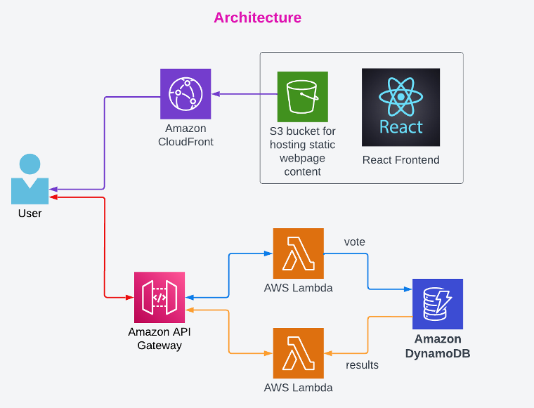

# Serverless Voting Application

In this mini project you will create a completely serverless voting application in two stages. First you will create the backend using API Gateway, Lambda functions and DynamoDB table. Then you will create the frontend application using ReactJS and deploy it to an S3 bucket for static website hosting which will be delivered using CloudFront CDN. Below is the architecture for this project.

# 1-Click Install

## Step 1 - Cloudformation Template

Make sure you are logged into AWS and in `us-east-1`. Apply the template below and wait for `CREATE_COMPLETE` before continuing

## [Serverless Voting Application](https://console.aws.amazon.com/cloudformation/home?region=us-east-1#/stacks/create/review?templateURL=https://github.com/ashish3121990/learn-cantrill-labs-1clickrepo/blob/branch-serverless-voting-app/aws-serverless-voting-app/aws-serverless-voting-app.yaml&stackName=Serverless-Voting-App-Demo)

